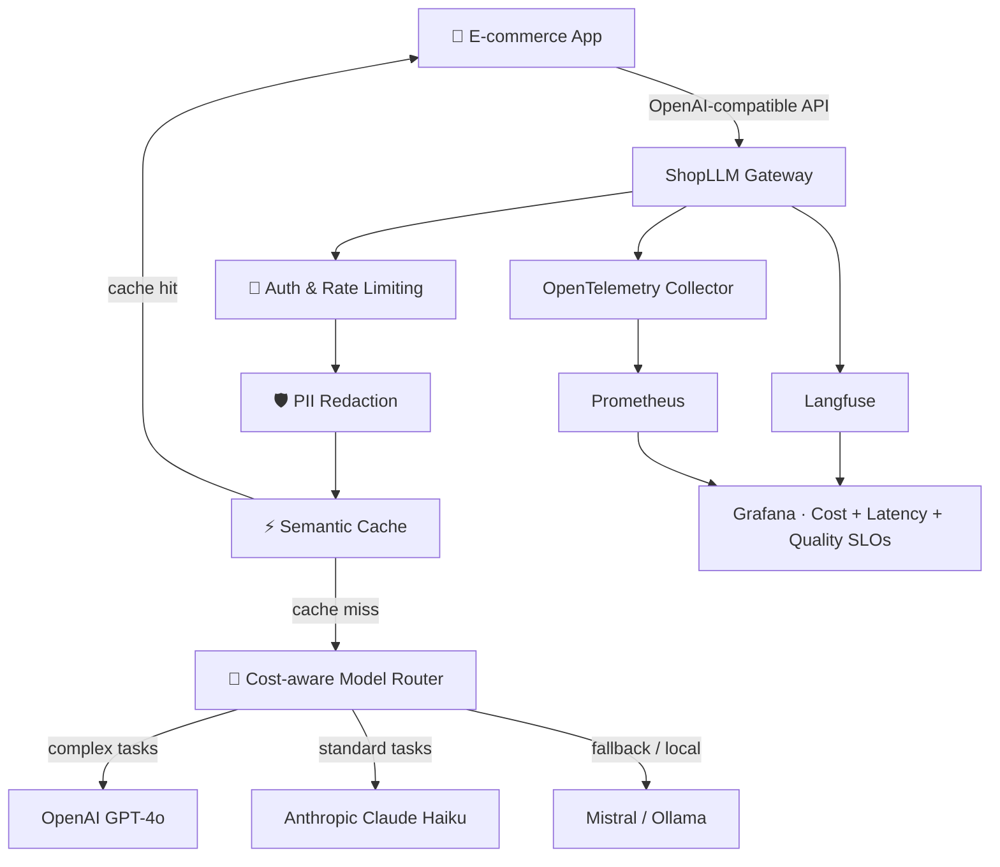

<div align="center">

# 🛒 ShopLLM Gateway

**The open-source LLM gateway purpose-built for e-commerce teams.**  
Multi-provider routing · Cost visibility per feature · PII redaction · Quality SLOs.

[](https://github.com/WomaninTech-spec/shopllm-gateway/actions)
[](./LICENSE)
[](#️-roadmap)
[](./src)
[](./docs/api.md)
[](./observability)

</div>

---

## 🔥 The Problem

E-commerce teams adding LLMs to production — augmented search, recommendations, customer support — hit the same wall every time:

| Pain point | What breaks |
|------------|-------------|
| 💸 Costs explode | No per-feature visibility — who's burning the budget? |
| 🔓 PII leaks into prompts | Emails, order IDs, payment info sent raw to third-party models |
| 🔁 Every team reinvents the wheel | Retries, rate limiting, injection detection duplicated across 20 services |
| 🔀 Provider lock-in | Switching Anthropic ↔ OpenAI ↔ Mistral means rewriting all your clients |
| 📉 Quality drifts silently | Hallucinations go undetected until a customer complains |

`shopllm-gateway` is a **single, opinionated infrastructure layer** between your apps and any LLM provider — built for e-commerce, not ML researchers.

---

## 🏗️ Architecture



---

## ✨ What This Demonstrates

### 🔀 Cost-Aware Routing & Semantic Cache


The gateway inspects task complexity and routes to the right model automatically — Haiku for classification, Sonnet for generation. Semantically equivalent prompts hit the cache regardless of exact wording.

---

### 📊 Cost & Quality Dashboard


Per-feature cost breakdown, latency p95 per route, and live quality scores from Langfuse evals — all in one Grafana view.

---

### 🗂️ Full Capability Matrix

| Capability | Stack | Status |
|------------|-------|--------|
| ⚙️ OpenAI-compatible `/v1/chat/completions` | FastAPI | ✅ Done |
| 🔀 Multi-provider routing (Anthropic · OpenAI · Mistral) | Pluggable adapter pattern | ✅ Done |
| 💡 Cost-aware model selection | Custom router | ✅ Done |
| 🛡️ PII detection & redaction | Presidio (e-commerce trained) | ✅ Done |
| ⚡ **Semantic caching** (embedding similarity) | Redis + sentence-transformers | ✅ Done |
| 💰 **Cost tracking per feature / tenant** | Langfuse + custom metrics | ✅ Done |
| 📈 Observability (latency · tokens · errors) | OpenTelemetry + Prometheus | ✅ Done |
| 🔍 **LLM output quality tracing** | Langfuse | ✅ Done |
| 🚦 Rate limiting + circuit breaker per tenant | Token bucket + circuit breaker | ✅ Done |
| 🔬 Prompt injection detection | Custom classifier | ✅ Done |
| 📋 GDPR-friendly audit trail | Structured logs + retention policies | ✅ Done |
| 🧪 Automated quality evals in CI | Ragas + golden datasets | 🚧 In progress |

---

## 🚀 Quick Start

### 📋 Prerequisites

```
✅ Docker + Docker Compose
✅ Python 3.11+
✅ OpenAI or Anthropic API key
✅ (Optional) Langfuse account or self-hosted instance
```

### ⚡ Up and running in 2 minutes

```bash
# 1️⃣  Clone and configure
git clone https://github.com/WomaninTech-spec/shopllm-gateway.git
cd shopllm-gateway
cp .env.example .env   # add your API keys

# 2️⃣  Start the full stack
docker compose up -d

# 3️⃣  Send your first request (drop-in OpenAI replacement)
curl http://localhost:8000/v1/chat/completions \
  -H "Content-Type: application/json" \
  -d '{
    "model": "auto",
    "messages": [{"role": "user", "content": "Suggest running shoes under €80"}],
    "x-feature": "recommendations"
  }'
```

| Service | URL |
|---------|-----|
| 🌐 Gateway (Swagger) | http://localhost:8000/docs |
| 📊 Grafana | http://localhost:3000 |
| 🔍 Langfuse | http://localhost:3001 |

### ☁️ Cloud Run deployment

See [`DEPLOY.md`](./DEPLOY.md) for the full Terraform + Cloud Run runbook.

---

## 🎯 SLOs — Quality Is Contractual

> **Fallback logic has its own SLO.** The gateway doesn't switch provider on HTTP 5xx alone — it monitors latency p95 and output coherence score per route to decide autonomously when to fall back.

| SLO | Target | SLI | Type |
|-----|--------|-----|------|
| 🟢 Gateway availability | 99.9% | 2xx/3xx request rate | Classic |
| ⚡ Latency p95 (cache hit) | < 50 ms | OTel histogram | Classic |
| ⚡ Latency p95 (live call) | < 2 s | OTel histogram | Classic |
| 💰 **Cost per feature / day** | Configurable budget cap | Langfuse custom metric | **AI-specific** |
| ✅ **Output quality score** | > 80% | Ragas coherence eval | **AI-specific** |
| 🔀 **Fallback trigger accuracy** | < 1% false positives | Quality SLO burn rate | **AI-specific** |
| 🔥 Monthly error budget | 0.1% | Burn rate alerting | Classic |

Full spec: [`docs/slos.md`](./docs/slos.md)

---

## 📐 Key Architecture Decisions (ADRs)

| # | Decision | Status |
|---|----------|--------|
| [ADR-001](./docs/adr/001-why-not-litellm.md) | Why not LiteLLM as the gateway layer | ✅ Accepted |
| [ADR-002](./docs/adr/002-semantic-cache-threshold.md) | Semantic cache similarity threshold strategy | ✅ Accepted |
| [ADR-003](./docs/adr/003-cost-per-feature.md) | Cost attribution model per feature / tenant | ✅ Accepted |
| [ADR-004](./docs/adr/004-fallback-slo.md) | Fallback trigger: quality-SLO-based vs error-based | ✅ Accepted |

---

## 🔍 What This Is (and Isn't)

**ShopLLM Gateway is a focused runtime infrastructure layer.**

| ✅ In scope | ❌ Out of scope |
|------------|----------------|
| Request routing & provider abstraction | Fine-tuning pipelines |
| Cost visibility & per-feature budget controls | Vector databases |
| PII redaction at the gateway level | Agent frameworks |
| Quality SLOs & autonomous fallback logic | Prompt management UI |
| Semantic caching | Frontend tooling |

**vs. generic gateways** (LiteLLM, Portkey, Helicone): ShopLLM Gateway is opinionated for e-commerce — PII detectors trained on order IDs, SKUs and billing data; metrics grouped per storefront / locale / feature; examples written for e-commerce engineers, not ML researchers.

---

## 📚 Repository Structure

```
shopllm-gateway/
│
├── 🌐 src/gateway/        Core gateway — routing, auth, rate limiting
├── 🛡️  src/security/       PII redaction + injection detection
├── ⚡ src/cache/           Semantic cache (embeddings + Redis)
├── 📈 src/observability/   OTel instrumentation + Langfuse integration
├── 📖 docs/               ADRs · API reference · runbooks
├── 🧪 tests/              Unit + integration + LLM eval suites
├── 🏗️  terraform/          Cloud Run + infra modules
└── 🔧 scripts/            Dev tooling + load testing
```

---

## 🛣️ Roadmap

```
✅  M1 — Minimal Anthropic + OpenAI clients
✅  M2 — FastAPI gateway with unified /v1/chat/completions
✅  M3 — PII redaction middleware
✅  M4 — Cost tracking & smart model routing
✅  M5 — Observability: structured logs + per-call cost estimation
✅  M6 — Guardrails: rate limiting + circuit breaker + retry budget
✅  M7 — Deployment: Docker + Cloud Run + Terraform + runbook
🚧  M8 — Automated evals in CI (Ragas + golden datasets)  ← current
⬜  M9 — Docs site + real-world examples
⬜  M10 — Multi-tenant admin UI + budget alerts
```

---

## 🔗 Ecosystem

| Role | Repository |
|------|-----------|
| 🧪 **This project** | [shopllm-gateway](https://github.com/WomaninTech-spec/shopllm-gateway) |
| 🏭 **Full platform** (infra + GitOps + AI agents) | [augmented-software-factory](https://github.com/WomaninTech-spec/augmented-software-factory) |

---

## 📖 Related Articles

- 📝 [Why I'm building ShopLLM Gateway](https://womanintech-spec.github.io/barbarateslar-portfolio/posts/why-shopllm-gateway)
- 📊 [SLOs on AI outputs: where to start](https://womanintech-spec.github.io/barbarateslar-portfolio/posts/slos-llm)
- 🔀 [Semantic caching: tuning the similarity threshold](https://womanintech-spec.github.io/barbarateslar-portfolio/posts/semantic-cache-threshold)

---

## 🤝 Contributing

Feedback, issues and PRs are welcome — this is built in public.  
See [`CONTRIBUTING.md`](./CONTRIBUTING.md) to get started.

## 📄 License

MIT — see [`LICENSE`](./LICENSE).

---

<div align="center">

**Built in public by [Barbara Teslar](https://womanintech-spec.github.io/barbarateslar-portfolio)**  
*Platform Engineering Manager · AI-Augmented Delivery*

</div>
